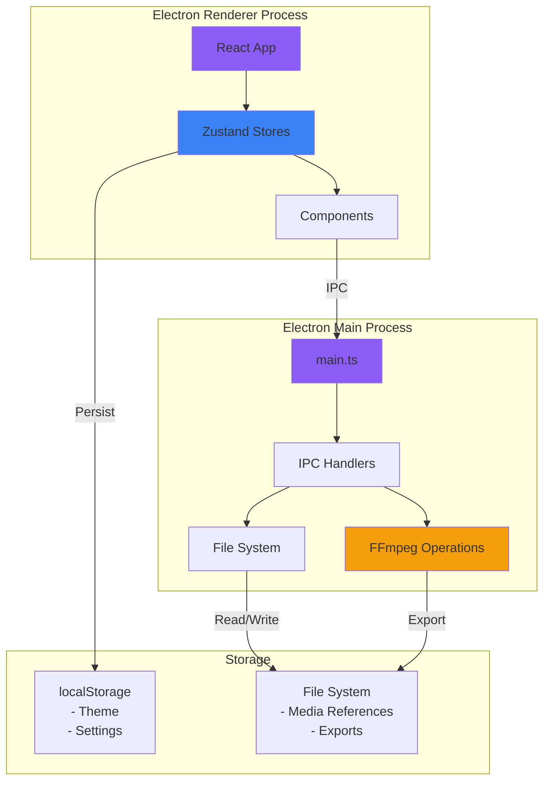
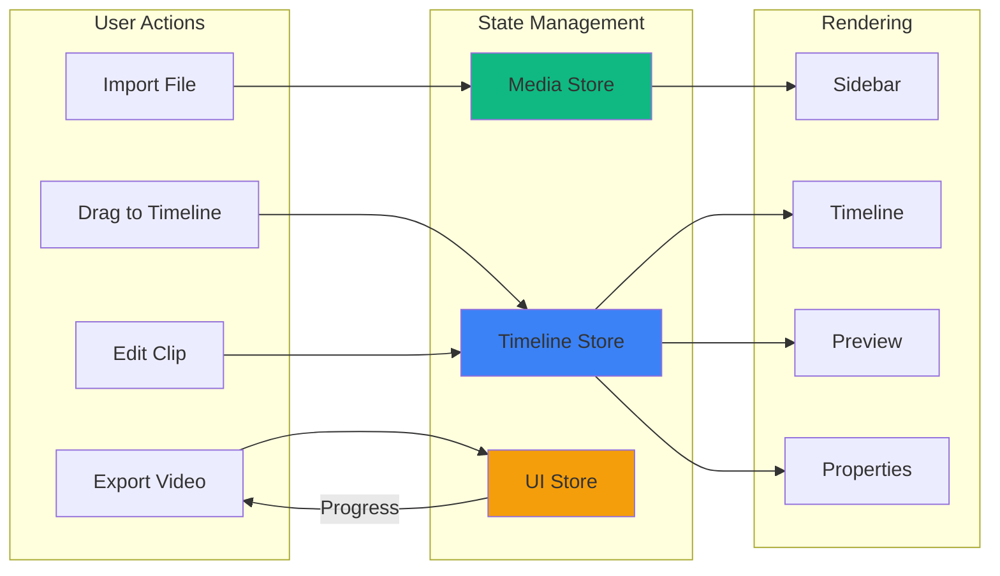
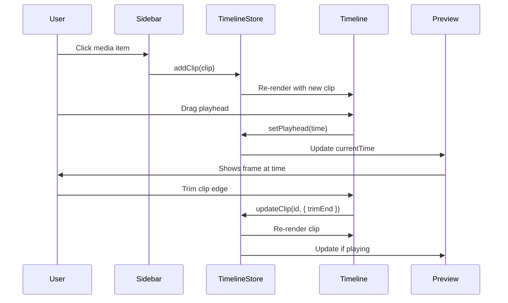
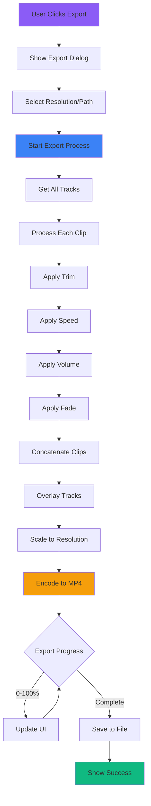
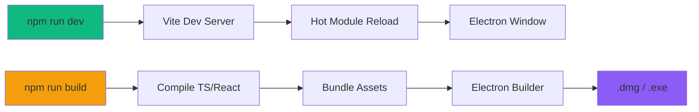

# ClipForge - File Structure & Architecture

## Project Structure Overview

```
clipforge/
├── electron/                          # Electron main process
│   ├── main.ts                       # Entry point for Electron
│   ├── preload.ts                    # Bridge between main and renderer
│   ├── ipc/                          # IPC handlers
│   │   ├── fileHandlers.ts          # File import/export
│   │   ├── recordingHandlers.ts     # Screen/camera recording
│   │   └── ffmpegHandlers.ts        # Video processing
│   ├── ffmpeg/                       # FFmpeg operations
│   │   ├── export.ts                # Export pipeline
│   │   ├── thumbnails.ts            # Thumbnail generation
│   │   └── utils.ts                 # FFmpeg utilities
│   └── utils/                        # Electron utilities
│       ├── window.ts                # Window management
│       └── menu.ts                  # App menu
│
├── src/                              # React renderer process
│   ├── components/                   # React components
│   │   ├── Layout/
│   │   │   ├── AppLayout.tsx        # Main 3-column layout
│   │   │   └── Header.tsx           # Top bar with logo
│   │   │
│   │   ├── Sidebar/
│   │   │   ├── Sidebar.tsx          # Main sidebar container
│   │   │   ├── RecordingPanel.tsx   # Recording controls
│   │   │   ├── MediaLibrary.tsx     # Media grid container
│   │   │   ├── MediaGrid.tsx        # Grid layout component
│   │   │   ├── MediaItem.tsx        # Single media item
│   │   │   └── ImportButton.tsx     # Import media button
│   │   │
│   │   ├── Preview/
│   │   │   ├── PreviewCanvas.tsx    # Main preview area
│   │   │   ├── VideoPlayer.tsx      # HTML5 video player
│   │   │   ├── PlaybackControls.tsx # Play/pause/seek controls
│   │   │   └── Timecode.tsx         # Time display
│   │   │
│   │   ├── Timeline/
│   │   │   ├── Timeline.tsx         # Main timeline container
│   │   │   ├── TimelineRuler.tsx    # Time markers (0s, 1:00, etc)
│   │   │   ├── TimelineControls.tsx # Zoom, export buttons
│   │   │   ├── Track.tsx            # Single track component
│   │   │   ├── Clip.tsx             # Timeline clip
│   │   │   ├── Playhead.tsx         # Current time indicator
│   │   │   └── TrackControls.tsx    # Add/remove tracks
│   │   │
│   │   ├── Properties/
│   │   │   ├── PropertiesPanel.tsx  # Right sidebar container
│   │   │   ├── ClipProperties.tsx   # When clip selected
│   │   │   ├── SpeedControl.tsx     # Speed slider
│   │   │   ├── VolumeControl.tsx    # Volume slider
│   │   │   ├── FadeControls.tsx     # Fade in/out
│   │   │   └── PositionControls.tsx # X/Y position
│   │   │
│   │   ├── Dialogs/
│   │   │   ├── RecordingDialog.tsx  # Source selection
│   │   │   ├── RecordingOutput.tsx  # Save options
│   │   │   ├── ExportDialog.tsx     # Export settings
│   │   │   ├── ProgressDialog.tsx   # Export progress
│   │   │   └── ContextMenu.tsx      # Right-click menu
│   │   │
│   │   └── UI/                       # Reusable UI components
│   │       ├── Button.tsx
│   │       ├── Slider.tsx
│   │       ├── Checkbox.tsx
│   │       ├── Input.tsx
│   │       ├── Select.tsx
│   │       └── Modal.tsx
│   │
│   ├── store/                        # State management (Zustand)
│   │   ├── mediaStore.ts            # Media library state
│   │   ├── timelineStore.ts         # Timeline state
│   │   ├── uiStore.ts               # UI state (recording, exporting)
│   │   └── themeStore.ts            # Theme preferences
│   │
│   ├── hooks/                        # Custom React hooks
│   │   ├── useTimeline.ts           # Timeline operations
│   │   ├── useMediaImport.ts        # File import logic
│   │   ├── useRecording.ts          # Recording logic
│   │   ├── usePlayback.ts           # Video playback
│   │   └── useTheme.ts              # Theme switching
│   │
│   ├── utils/                        # Utility functions
│   │   ├── fileHandling.ts          # File operations
│   │   ├── timelineCalculations.ts  # Time/position math
│   │   ├── formatters.ts            # Time formatting (MM:SS)
│   │   ├── thumbnailGenerator.ts    # Generate thumbnails
│   │   └── constants.ts             # App constants
│   │
│   ├── types/                        # TypeScript types
│   │   ├── media.ts                 # MediaAsset, etc.
│   │   ├── timeline.ts              # Track, Clip, Timeline
│   │   └── theme.ts                 # Theme types
│   │
│   ├── styles/                       # Styling
│   │   ├── themes.css               # Theme variables
│   │   └── globals.css              # Global styles
│   │
│   ├── App.tsx                       # Root React component
│   ├── main.tsx                      # React entry point
│   └── vite-env.d.ts                # Vite type declarations
│
├── public/                           # Static assets
│   ├── icons/                        # App icons
│   └── fonts/                        # Custom fonts (if any)
│
├── dist/                             # Build output (gitignored)
├── dist-electron/                    # Electron build (gitignored)
│
├── .gitignore
├── package.json
├── tsconfig.json
├── vite.config.ts
├── electron-builder.json             # Packaging config
├── tailwind.config.js
├── postcss.config.js
└── README.md
```

---

## Theme System - 6 Colors

### Color Palette

```typescript
// src/types/theme.ts
export interface Theme {
  name: string;
  colors: {
    primary: string;      // Main accent (buttons, highlights)
    background: string;   // Main background
    surface: string;      // Cards, panels
    border: string;       // Borders, dividers
    text: string;         // Primary text
    textSecondary: string; // Secondary text, labels
  };
}

export const themes: Record<string, Theme> = {
  dark: {
    name: 'Dark',
    colors: {
      primary: '#8B5CF6',      // Purple (like Clipchamp)
      background: '#0A0A0A',   // Very dark gray
      surface: '#1A1A1A',      // Dark gray (panels)
      border: '#2A2A2A',       // Slightly lighter gray
      text: '#FFFFFF',         // White
      textSecondary: '#A0A0A0' // Light gray
    }
  },
  
  light: {
    name: 'Light',
    colors: {
      primary: '#8B5CF6',      // Purple (same)
      background: '#FFFFFF',   // White
      surface: '#F5F5F5',      // Light gray
      border: '#E0E0E0',       // Gray border
      text: '#0A0A0A',         // Dark text
      textSecondary: '#666666' // Gray text
    }
  },
  
  midnight: {
    name: 'Midnight',
    colors: {
      primary: '#3B82F6',      // Blue
      background: '#0F172A',   // Dark blue-gray
      surface: '#1E293B',      // Slate
      border: '#334155',       // Lighter slate
      text: '#F1F5F9',         // Off-white
      textSecondary: '#94A3B8' // Blue-gray
    }
  },
  
  sunset: {
    name: 'Sunset',
    colors: {
      primary: '#F59E0B',      // Orange
      background: '#1C1917',   // Dark brown
      surface: '#292524',      // Brown-gray
      border: '#44403C',       // Light brown
      text: '#FAFAF9',         // Off-white
      textSecondary: '#A8A29E' // Warm gray
    }
  },
  
  forest: {
    name: 'Forest',
    colors: {
      primary: '#10B981',      // Green
      background: '#064E3B',   // Dark green
      surface: '#065F46',      // Forest green
      border: '#047857',       // Green border
      text: '#ECFDF5',         // Light green tint
      textSecondary: '#A7F3D0' // Mint
    }
  },
  
  ocean: {
    name: 'Ocean',
    colors: {
      primary: '#06B6D4',      // Cyan
      background: '#083344',   // Dark teal
      surface: '#0E7490',      // Teal
      border: '#155E75',       // Lighter teal
      text: '#ECFEFF',         // Cyan white
      textSecondary: '#A5F3FC' // Light cyan
    }
  }
};
```

---

## CSS Variables Setup

```css
/* src/styles/themes.css */

:root {
  /* Default theme (dark) */
  --color-primary: #8B5CF6;
  --color-background: #0A0A0A;
  --color-surface: #1A1A1A;
  --color-border: #2A2A2A;
  --color-text: #FFFFFF;
  --color-text-secondary: #A0A0A0;
  
  /* Spacing */
  --spacing-xs: 4px;
  --spacing-sm: 8px;
  --spacing-md: 16px;
  --spacing-lg: 24px;
  --spacing-xl: 32px;
  
  /* Border radius */
  --radius-sm: 4px;
  --radius-md: 8px;
  --radius-lg: 12px;
  
  /* Transitions */
  --transition-fast: 150ms ease;
  --transition-normal: 300ms ease;
}

/* Theme classes */
body.theme-dark {
  --color-primary: #8B5CF6;
  --color-background: #0A0A0A;
  --color-surface: #1A1A1A;
  --color-border: #2A2A2A;
  --color-text: #FFFFFF;
  --color-text-secondary: #A0A0A0;
}

body.theme-light {
  --color-primary: #8B5CF6;
  --color-background: #FFFFFF;
  --color-surface: #F5F5F5;
  --color-border: #E0E0E0;
  --color-text: #0A0A0A;
  --color-text-secondary: #666666;
}

body.theme-midnight {
  --color-primary: #3B82F6;
  --color-background: #0F172A;
  --color-surface: #1E293B;
  --color-border: #334155;
  --color-text: #F1F5F9;
  --color-text-secondary: #94A3B8;
}

body.theme-sunset {
  --color-primary: #F59E0B;
  --color-background: #1C1917;
  --color-surface: #292524;
  --color-border: #44403C;
  --color-text: #FAFAF9;
  --color-text-secondary: #A8A29E;
}

body.theme-forest {
  --color-primary: #10B981;
  --color-background: #064E3B;
  --color-surface: #065F46;
  --color-border: #047857;
  --color-text: #ECFDF5;
  --color-text-secondary: #A7F3D0;
}

body.theme-ocean {
  --color-primary: #06B6D4;
  --color-background: #083344;
  --color-surface: #0E7490;
  --color-border: #155E75;
  --color-text: #ECFEFF;
  --color-text-secondary: #A5F3FC;
}

/* Apply theme colors */
body {
  background-color: var(--color-background);
  color: var(--color-text);
  transition: background-color var(--transition-normal),
              color var(--transition-normal);
}
```

---

## Theme Store

```typescript
// src/store/themeStore.ts
import { create } from 'zustand';
import { persist } from 'zustand/middleware';

interface ThemeStore {
  currentTheme: string;
  setTheme: (theme: string) => void;
}

export const useThemeStore = create<ThemeStore>()(
  persist(
    (set) => ({
      currentTheme: 'dark',
      
      setTheme: (theme) => {
        // Update CSS class on body
        document.body.className = `theme-${theme}`;
        set({ currentTheme: theme });
      },
    }),
    {
      name: 'clipforge-theme', // localStorage key
    }
  )
);
```

---

## Theme Selector Component

```typescript
// src/components/UI/ThemeSelector.tsx
import { useThemeStore } from '@/store/themeStore';
import { themes } from '@/types/theme';

export function ThemeSelector() {
  const { currentTheme, setTheme } = useThemeStore();
  
  return (
    <div className="theme-selector">
      <label>Theme</label>
      <select 
        value={currentTheme} 
        onChange={(e) => setTheme(e.target.value)}
        className="theme-select"
      >
        {Object.entries(themes).map(([key, theme]) => (
          <option key={key} value={key}>
            {theme.name}
          </option>
        ))}
      </select>
      
      {/* Color preview */}
      <div className="theme-preview">
        <div 
          className="preview-swatch" 
          style={{ backgroundColor: themes[currentTheme].colors.primary }}
        />
      </div>
    </div>
  );
}
```

---

## Tailwind Config (Using CSS Variables)

```javascript
// tailwind.config.js
/** @type {import('tailwindcss').Config} */
export default {
  content: [
    "./index.html",
    "./src/**/*.{js,ts,jsx,tsx}",
  ],
  theme: {
    extend: {
      colors: {
        primary: 'var(--color-primary)',
        background: 'var(--color-background)',
        surface: 'var(--color-surface)',
        border: 'var(--color-border)',
        text: 'var(--color-text)',
        'text-secondary': 'var(--color-text-secondary)',
      },
    },
  },
  plugins: [],
}
```

---

## Usage Example

```tsx
// Any component can use theme colors via Tailwind
<div className="bg-surface border border-border rounded-md p-4">
  <h2 className="text-text">Title</h2>
  <p className="text-text-secondary">Description</p>
  <button className="bg-primary text-white px-4 py-2 rounded">
    Action
  </button>
</div>
```

---

## Architecture Diagram (Mermaid)

### System Architecture



### Component Data Flow



### Timeline State Flow



### Export Pipeline



---

## File Size Estimates

```
electron/              ~50 KB    (TypeScript files)
src/components/        ~200 KB   (React components)
src/store/            ~20 KB    (State management)
src/hooks/            ~30 KB    (Custom hooks)
src/utils/            ~40 KB    (Utilities)
src/types/            ~10 KB    (TypeScript types)
src/styles/           ~10 KB    (CSS)
node_modules/         ~500 MB   (Dependencies)
dist/                 ~5 MB     (Built app)
Final .dmg/.exe       ~150 MB   (With FFmpeg binary)
```

---

## Development Workflow



---

## Where Theme Selector Goes

Add to app header or settings menu:

```tsx
// src/components/Layout/Header.tsx
import { ThemeSelector } from '@/components/UI/ThemeSelector';

export function Header() {
  return (
    <header className="bg-surface border-b border-border px-4 py-2 flex justify-between items-center">
      <div className="flex items-center gap-2">
        
        <h1 className="text-xl font-bold text-text">ClipForge</h1>
      </div>
      
      <div className="flex items-center gap-4">
        <ThemeSelector />
        <button className="text-text-secondary hover:text-text">
          Settings
        </button>
      </div>
    </header>
  );
}
```

---

## Summary

### File Structure
- ✅ Clean separation: electron/ and src/
- ✅ Component organization by feature
- ✅ Shared store for state
- ✅ Utilities isolated

### Theme System
- ✅ 6 pre-built themes
- ✅ CSS variables (easy to extend)
- ✅ Persists to localStorage
- ✅ Works with Tailwind
- ✅ Simple theme selector UI

### Architecture
- ✅ Mermaid diagrams for visualization
- ✅ Clear data flow
- ✅ IPC communication patterns
- ✅ Export pipeline

---

## Next Steps

1. Create this file structure
2. Set up theme system
3. Start building components
4. Reference diagrams as you build

Want me to:
1. Generate the folder structure commands?
2. Create the initial theme files?
3. Start building the first component?